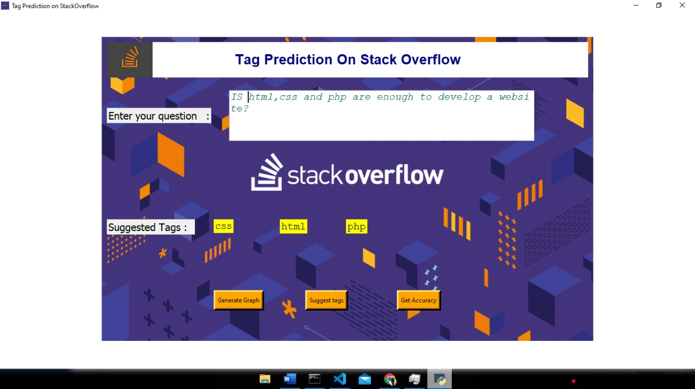

# TAG-PREDICTION
 
 An Automated tag prediction system is developed to ease the users by providing necessary tags for the questions.
 

## OBJECTIVE

   1. To predict the tags for the given question.
   2. Plot the accuracy graph for all the classifiers.

### DATA PREPROCESSING
The dataset downloaded from https://www.kaggle.com/datasets/stackoverflow/stacksample is preprocessed and written on a new file (empty.csv).
processed.py is the code for preprocessing.

### MAIN MODULE
In this four classifiers are used namely SVM,Logistic Regression,SGD,KNN.They are mean to do the classification and then the accuracy is get calculated for comparison.

  

